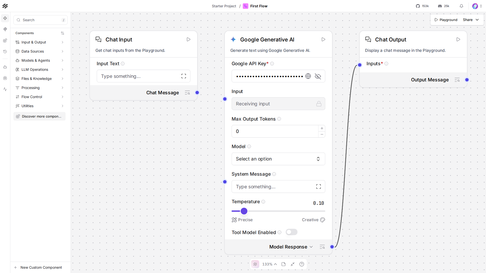

# Lesson 2: Chat Input -> Google Generative AI -> Chat Output

## What we're building

The smallest flow that actually does something: type a message, it goes
to Gemini, the answer comes back. Three components, two connections.
You'll build this by hand on the canvas first, then read the Python
that produces the exact same flow as a `.dump()`'d graph.

## Do this yourself

1. In your still-running Langflow tab, click **New Flow** -> **Blank Flow**.
2. From the **Input & Output** section in the left sidebar, drag a
   **Chat Input** onto the canvas.
3. Search the component sidebar for "Google" and drag the **Google
   Generative AI** component onto the canvas, a real, built-in
   component, nothing to write yourself for this one.
4. Open its settings and paste your `GOOGLE_API_KEY` (the same one in
   this project's `.env`) into the **Google API Key** field, and set
   **Model** to `gemini-3.5-flash-lite`, matching every other course in
   this repo.
5. From **Input & Output**, drag a **Chat Output** onto the canvas.
6. Connect them: drag from Chat Input's output dot to the Google
   Generative AI component's `Input` dot, then from its output dot to
   Chat Output's input dot.
7. Click **Playground** (top right), type a message, confirm you get a
   real Gemini response back.

Compare what you built to `canvas.png` in this folder, a screenshot of
this exact flow:



## Why the built-in component, not a Custom Component

An earlier draft of this course used a small hand-written Custom
Component here instead, it's a reasonable-looking shortcut, but it
turns out to be the wrong one: Langflow's own component-migration
subsystem doesn't recognize component types it doesn't ship, and
hitting that path can trigger a real bug (an internal retry loop) on
some runs, not something a lesson should route learners into by
default. Every **built-in** component, like the one you just dragged
onto the canvas, is registered and recognized, so it never touches that
code path at all. Lesson 12 covers writing your own Custom Component
deliberately, once you've seen enough of Langflow's other pieces for
that lesson's own caution notes to make sense.

## The code, piece by piece

```python
gemini = GoogleGenerativeAIComponent()
gemini.set(
    input_value=chat_input.message_response,
    model_name="gemini-3.5-flash-lite",
    api_key=os.environ["GOOGLE_API_KEY"],
)
```

`GoogleGenerativeAIComponent` is the real component behind the "Google
Generative AI" box you dragged onto the canvas, importable and usable
directly in code. `model_name` and `api_key` are the same fields you
filled in by hand, `api_key` here is set from this project's own `.env`
directly (Lesson 7 covers the *better* way to do this, without a raw
key sitting in a Python file at all).

```python
chat_input = ChatInput()
...
chat_output = ChatOutput()
chat_output.set(input_value=gemini.text_response)
```

This is the code equivalent of the edges you just dragged by hand.
`.set()` wires one component's output method (`chat_input.message_response`)
into another's input field (`gemini.input_value`), the same connection
the canvas draws as a line between two dots.

```python
graph = Graph(start=chat_input, end=chat_output)
```

`Graph` is Langflow's version of `StateGraph` from the `langgraph`
course, a container that knows the full shape of connected components
and can run them in order.

```python
rebuilt = graph.dump()
```

`.dump()` turns the graph into the same JSON structure the canvas's own
**Export** button writes, this is exactly how `flow.json` in this
folder was produced.

```python
result = run_flow_from_json(flow=str(FLOW_PATH), input_value="Say hello in exactly three words.")
```

`run_flow_from_json` is the headless path: give it a flow (a file path,
or a dict, either works) and an input, it runs the whole flow start to
finish with no browser and no running server needed for this call
specifically, it loads and executes the flow directly in this process.

## Running it

```bash
uv run python lessons/langflow/01_beginner/02_first_flow/lesson.py
```

## Expected output

Approximate, Gemini's exact phrasing varies:

```
Gemini said: Hello to you.
```

## Checkpoint

- **built-in components stay registered**, and avoid a real
  Langflow-side bug that unrecognized (Custom) component types can
  trigger, more on this in Lesson 12.
- **`.set()`**: wires one component's output into another's input in
  code, the same thing a dragged connection does on the canvas.
- **`Graph`**: the container for a connected set of components, this
  course's equivalent of `StateGraph`.
- **`.dump()` / `run_flow_from_json`**: turning a graph into JSON, and
  running that JSON headlessly, no browser required.

If anything here still feels unclear, ask before moving to Lesson 3.
