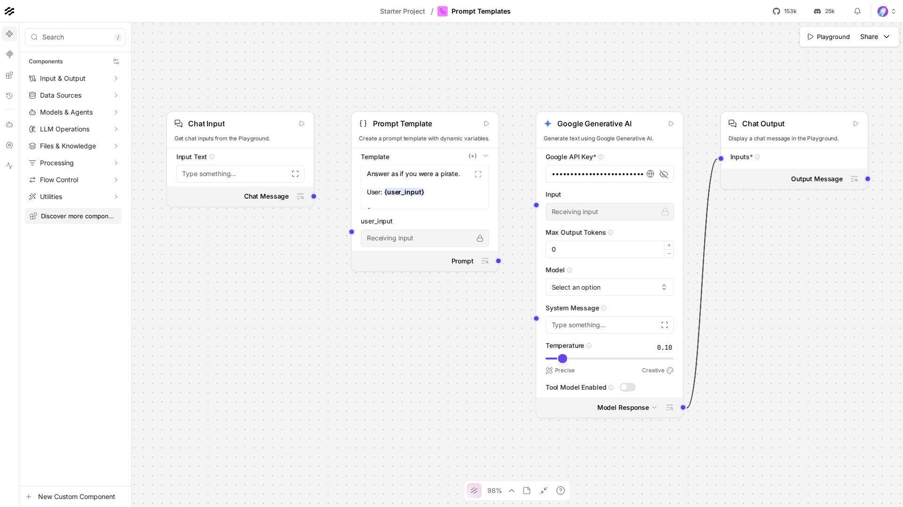

# Lesson 4: the Prompt component and {variables}

## Where we left off

Lesson 2's flow sent whatever you typed straight to Gemini, no shaping
at all. Most real flows want to wrap the user's input in something,
instructions, examples, formatting, before it reaches the model. That's
what the **Prompt Template** component is for.

## Do this yourself

1. Start a new flow (or clear Lesson 2's canvas).
2. Drag a **Chat Input** onto the canvas.
3. From **Models & Agents**, drag a **Prompt Template** component onto
   the canvas. In its **Template** field, type:

   ```
   Answer as if you were a pirate.

   User: {user_input}

   Answer:
   ```

   The moment you type `{user_input}`, Langflow adds a new input field
   to the component named `user_input`, matching what's in the braces.
   Compare to `canvas.png` in this folder, a screenshot of exactly this:

   

4. Connect Chat Input's output to the Prompt Template's new
   `user_input` input.
5. Add a **Google Generative AI** component (same setup as Lesson 2:
   your API key, model set to `gemini-3.5-flash-lite`) and a Chat
   Output, and connect Prompt Template's **Prompt** output into the
   Google Generative AI component's **Input**, then its output into
   Chat Output.
6. Open the Playground, ask something ordinary ("What's the weather
   like?"), and confirm the answer comes back in pirate voice, that's
   the template doing its job.

## The code, piece by piece

```python
prompt = PromptComponent()
prompt.set(
    template="Answer as if you were a pirate.\n\nUser: {user_input}\n\nAnswer:",
    user_input=chat_input.message_response,
)
```

`template` is a plain string with `{user_input}` inside it, the same
`{name}` syntax as Python's own `str.format()`. Setting `user_input=`
to `chat_input.message_response` is the code form of the connection you
dragged in the browser: whatever Chat Input produces fills in that slot
every time the flow runs.

```python
gemini.set(input_value=prompt.build_prompt)
```

`build_prompt` is the Prompt component's output, the fully filled-in
string (template with `{user_input}` replaced), wrapped as a `Message`
so it can feed straight into Gemini's `input_value`, the same
`Message`-typed contract from Lesson 3.

## Running it

```bash
uv run python lessons/langflow/01_beginner/04_prompt_templates/lesson.py
```

## Expected output

Approximate, Gemini's exact phrasing (and how thoroughly it commits to
the pirate voice) varies:

```
Gemini said: Ahoy, matey!

If ye be askin' 'bout the skies, step ye out o' the cabin and cast an eye to the horizon!
...
```

## Checkpoint

- **Prompt Template**: a component that wraps user input (or any
  connected value) inside a larger string, `{variable}` placeholders
  become real input ports automatically.
- **one template, many variables**: every `{name}` in the template adds
  its own connectable input, not just one.
- **`build_prompt`**: the component's output, a `Message` carrying the
  fully filled-in string, ready to feed a model the same way raw chat
  input does.

If anything here still feels unclear, ask before moving to Lesson 5.
