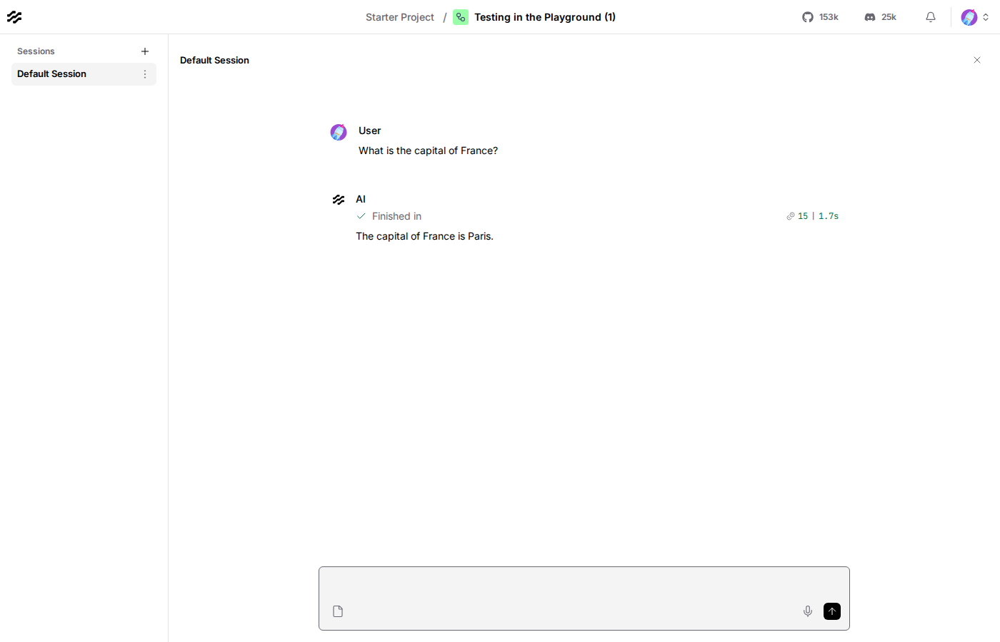

# Lesson 6: the Playground, and what it's actually doing

## Where we left off

Every earlier lesson had you click **Playground** to try a flow once.
This lesson looks at what that panel actually is: not a special
preview mode, just a chat UI that calls the same run your `lesson.py`
files call, over and over, once per message you send.

## Do this yourself

1. Build the flow from Lesson 2 again (or reopen it): Chat Input ->
   Google Generative AI -> Chat Output.
2. Open **Playground**. Send a few different messages, one at a time,
   watch each response come back with a "Finished in" timing and a
   token count, like this:

   

3. Ask something, then in your very next message ask "what did I just
   ask you?". Notice it doesn't know, each message you send is a fresh
   run of the flow, Lesson 8 is what actually fixes this.

## The code, piece by piece

```python
questions = [
    "What's your name?",
    "What's the capital of France?",
    "Do you remember what I just asked you?",
]
for question in questions:
    result = run_flow_from_json(flow=str(FLOW_PATH), input_value=question)
    answer = result[0].outputs[0].messages[0].message
    print(f"> {question}")
    print(f"{answer}\n")
```

This loop *is* the Playground, minus the chat bubbles. Every message
you type there triggers exactly one more call like this, the same flow
loaded and run fresh, your new text as `input_value`. There's nothing
the browser does here that this code doesn't: no shared memory between
calls, no special preview-only behavior, it's the identical headless
path every earlier lesson already used, just called more than once.

## Running it

```bash
uv run python lessons/langflow/01_beginner/06_testing_in_the_playground/lesson.py
```

## Expected output

Approximate, Gemini's phrasing varies, but notice the third answer:

```
> What's your name?
I don't have a name. I am a large language model, trained by Google.

> What's the capital of France?
The capital of France is Paris.

> Do you remember what I just asked you?
Yes! You just asked me, "Do you remember what I just asked you?"
...
```

The third response only "remembers" the message it was just given, not
the capital-of-France question two calls earlier, exactly what you saw
testing it yourself in the browser.

## Checkpoint

- **Playground**: a chat UI over the same run path every lesson's code
  already uses, one flow execution per message sent, nothing special
  happening underneath.
- **no memory between runs, by default**: each call to `run_flow_from_json`
  (or each Playground message) is a clean, independent execution, not a
  continuing conversation.

If anything here still feels unclear, ask before moving to Lesson 7.
