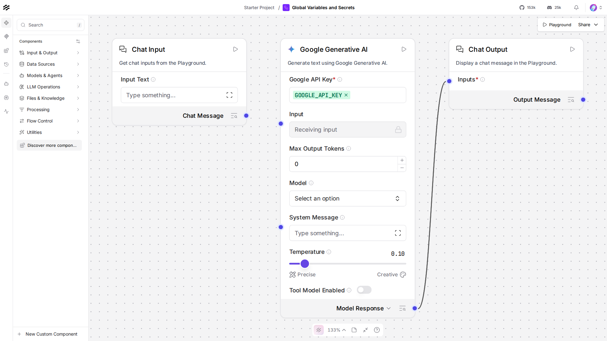

# Lesson 7: Global Variables, not hardcoded secrets

## Where we left off

Every flow so far had you paste your `GOOGLE_API_KEY` straight into the
Google Generative AI component's own field. That's fine for a two-node
test, but it means the key lives inside the flow itself, copy-pasted
into every new flow that needs it, and sitting in plain text if you
ever export or share that flow's JSON. **Global Variables** fix this:
one place to store a secret, referenced by name from as many components
as you want.

## Setup for this lesson

This lesson calls Langflow's REST API directly (more on why below), so
it needs its own API key, separate from your Gemini key:

```bash
uv run langflow api-key
```

Copy the printed key into `.env` as `LANGFLOW_API_KEY=...` (see
`.env.example` at the project root). Langflow already auto-created a
`GOOGLE_API_KEY` Global Variable for you at first startup, picked up
from your own `GOOGLE_API_KEY` in `.env`, nothing to configure there.

## Do this yourself

1. Open **Settings -> Global Variables** in Langflow (left sidebar of
   the Settings page). Confirm `GOOGLE_API_KEY` is already listed,
   type `Credential`, value masked.
2. Build the Lesson 2 flow again (or reopen it): Chat Input -> Google
   Generative AI -> Chat Output.
3. Open the Google Generative AI component's settings. Instead of
   typing your key into **Google API Key**, click the field and pick
   **GOOGLE_API_KEY** from the dropdown of existing Global Variables.
   Compare to `canvas.png`, a screenshot of exactly this:

   

4. Run it in the Playground, confirm it still works, same as before,
   just without a raw key sitting in the flow.

## Why this lesson uses the REST API, not run_flow_from_json

Resolving a Global Variable by name has to know *which user's*
variables to look up, that identity comes from an authenticated
request. Langflow's real server has that context on every REST call.
`run_flow_from_json`, this course's headless loader everywhere else, is
a self-contained, in-process call with no request behind it, so it
can't resolve `load_from_db` fields correctly. Lesson 11 covers the
REST API on its own terms, this lesson borrows just enough of it now
because it's the only path that actually demonstrates Global Variables
working.

## The code, piece by piece

```python
gemini.set(input_value=chat_input.message_response, model_name="gemini-3.5-flash-lite", api_key="GOOGLE_API_KEY")
gemini._inputs["api_key"].load_from_db = True
```

Setting `api_key="GOOGLE_API_KEY"` stores that string as the field's
value, the variable's *name*, not a real key. `.set()` also resets
`load_from_db` to `False` by default (it assumes a literal value unless
told otherwise), so it has to be turned back on explicitly, the exact
flag the canvas sets when you pick a variable from that dropdown
instead of typing a value.

```python
def upload_flow() -> str:
    with FLOW_PATH.open("rb") as f:
        response = httpx.post(
            f"{LANGFLOW_URL}/api/v1/flows/upload/",
            headers=HEADERS,
            files={"file": ("flow.json", f, "application/json")},
        )
    response.raise_for_status()
    return response.json()[0]["id"]
```

This is the code form of dragging `flow.json` onto the flows dashboard,
Langflow assigns it a new `flow_id` on the server, needed before you
can run it over the REST API.

```python
def run_flow(flow_id: str, input_value: str) -> str:
    response = httpx.post(
        f"{LANGFLOW_URL}/api/v1/run/{flow_id}",
        headers=HEADERS,
        json={"input_value": input_value},
        timeout=30,
    )
    response.raise_for_status()
    data = response.json()
    return data["outputs"][0]["outputs"][0]["messages"][0]["message"]
```

The actual run: `POST /api/v1/run/{flow_id}`, authenticated with
`LANGFLOW_API_KEY`. This is what resolves `GOOGLE_API_KEY` correctly,
the request carries a real user context the way `run_flow_from_json`
never does.

## Running it

```bash
uv run python lessons/langflow/01_beginner/07_global_variables_and_secrets/lesson.py
```

## Expected output

Approximate, Gemini's exact phrasing varies:

```
Gemini said: Well hello there!
```

## Checkpoint

- **Global Variable**: one named, stored secret (or plain value),
  referenced by name from any component field that opts in, instead of
  copy-pasted everywhere it's needed.
- **`load_from_db`**: the flag that makes a field read its value as a
  variable *name* to look up, instead of a literal value, `.set()`
  turns it off by default and it has to be re-enabled explicitly for a
  name-based reference.
- **why REST here**: variable resolution needs a real authenticated
  request context, something only the actual server call provides.

If anything here still feels unclear, ask before moving to Lesson 8.
