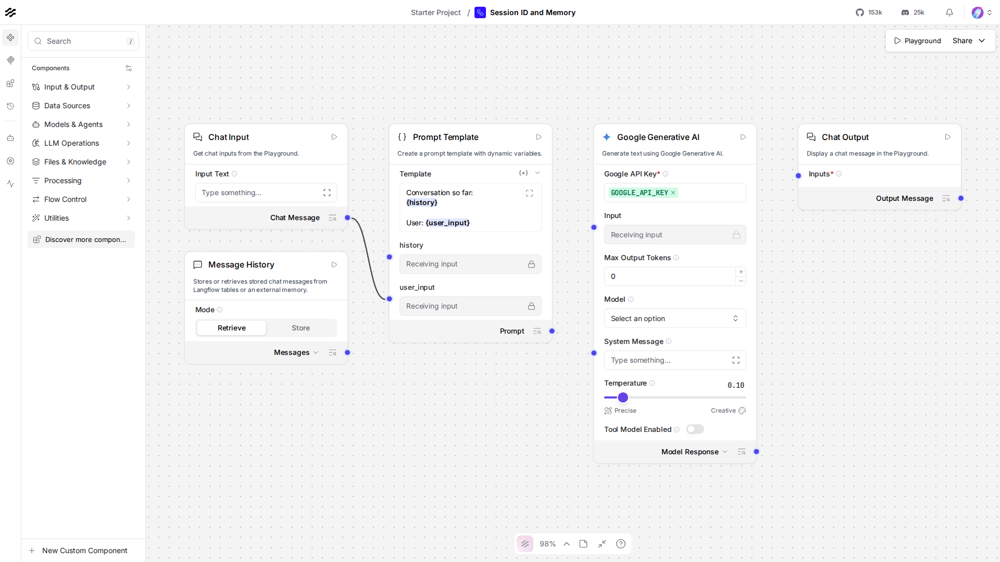

# Lesson 8: session_id and the Memory component

## Where we left off

Lesson 6 showed a flow that forgets everything between messages, each
run starts clean, no idea what was asked a moment ago. That's the
default. This lesson fixes it: two pieces, a `session_id` to group
messages together, and a **Message History** component to read them
back out.

## Do this yourself

1. Build on the Lesson 4 flow (Chat Input -> Prompt -> Google
   Generative AI -> Chat Output), or reopen it.
2. From **Models & Agents**, drag a **Message History** component onto
   the canvas, set its **Mode** to **Retrieve**.
3. Open Chat Input's settings and set **Session ID** to a fixed string
   like `demo-session` (leave it blank and Langflow generates a random
   one per run, which defeats the point). Set Chat Output's Session ID
   to the exact same string.
4. Add a new `{history}` variable to the Prompt Template (alongside the
   `{user_input}` from Lesson 4), and connect Message History's output
   into it.
5. Open the Playground, tell it something ("My favorite color is
   teal."), then in your *next* message ask "what's my favorite
   color?" and confirm it actually remembers this time. Compare to
   `canvas.png`, a screenshot of this flow:

   

## Why this lesson uses the REST API, not run_flow_from_json

Message history lives in the server's own database, keyed by
`session_id`. `run_flow_from_json` is a self-contained, in-process
call, running it twice in the same script gives you two independent
executions with nothing shared between them, so the second call would
never see what the first one stored. Only a real request against the
running server, the REST API, reads and writes that same shared
history. Lesson 11 covers the REST API on its own terms, this lesson
borrows just enough of it now because it's the only path that actually
demonstrates memory working.

## The code, piece by piece

```python
chat_input = ChatInput()
chat_input.set(session_id=session_id)
```

Every message Chat Input handles gets stored under this `session_id`,
automatically, that storage is what Message History reads back later.
Chat Output does the same on the way out, so the model's own replies
get stored too, not just what the user typed.

```python
memory = MemoryComponent()
memory.set(session_id=session_id)
```

`MemoryComponent` (the "Message History" box you dragged) reads
everything stored under a `session_id` and hands it back as one block
of text through `retrieve_messages_as_text`, the whole point of giving
it the same `session_id` as Chat Input and Chat Output.

```python
prompt.set(
    template="Conversation so far:\n{history}\n\nUser: {user_input}\n\nAnswer:",
    history=memory.retrieve_messages_as_text,
    user_input=chat_input.message_response,
)
```

Two variables in one template now, `{history}` (everything said so
far) and `{user_input}` (this turn's message), both wired in as
connections exactly like Lesson 4's single-variable version.

```python
first = run_flow(flow_id, "My favorite color is teal.", SESSION_ID)
second = run_flow(flow_id, "What is my favorite color?", SESSION_ID)
```

Two separate REST calls, same `flow_id`, same `session_id`. The second
call's Memory component reads back what the first call's Chat Input and
Chat Output stored, that's the entire mechanism, nothing about the
model itself changed since Lesson 4.

## Running it

```bash
uv run python lessons/langflow/01_beginner/08_session_id_and_memory/lesson.py
```

## Expected output

Approximate, Gemini's exact phrasing varies, but the second answer
should correctly reference teal:

```
Gemini: Teal is a gorgeous color! ...
Gemini: Your favorite color is teal!
```

## Checkpoint

- **`session_id`**: the key Chat Input/Chat Output store messages
  under, give two calls the same one and they share history.
- **Message History (`MemoryComponent`)**: reads everything stored
  under a `session_id` back out as text, feed it into a Prompt
  Template's `{history}` variable to give the model context.
- **why REST here**: shared history lives in the server's own
  database, only a real request against the running server reads and
  writes it.

If anything here still feels unclear, ask before moving to Lesson 9.
