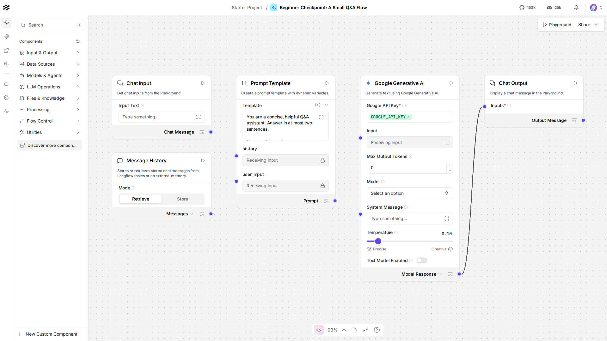

# Lesson 9: Checkpoint. A Small Q&A Flow, Built End to End

## What we're building

Every piece from Beginner, in one flow: a Prompt Template with a system
instruction and two variables, a real Google Generative AI component
whose API key comes from a Global Variable, and Message History giving
it memory across turns. Ask it something, then ask a follow-up that
only makes sense if it remembers the first answer.

## Do this yourself

1. Build the flow fresh, from an empty canvas, no reopening an earlier
   lesson this time:
   - **Chat Input**, Session ID set to a fixed string.
   - **Message History**, Mode `Retrieve`, same Session ID.
   - **Prompt Template**, with `{history}` and `{user_input}` variables,
     and an instruction of your own choosing ("answer concisely",
     "answer like a pirate", whatever you'd like) written directly into
     the template text.
   - **Google Generative AI**, model `gemini-3.5-flash-lite`, API key
     picked from the `GOOGLE_API_KEY` Global Variable, not typed in.
   - **Chat Output**, same Session ID as Chat Input.
2. Wire it exactly like Lesson 8's flow: Chat Input's message and
   Message History's retrieved text both into the Prompt Template,
   Prompt Template's output into the model, the model's output into
   Chat Output.
3. In the Playground, ask a question, then ask a follow-up that only
   makes sense with memory of the first ("How tall is it, in meters?"
   after asking about a mountain). Confirm it actually follows up
   correctly. Compare to `canvas.png`, a screenshot of this flow:

   

## Running it

```bash
uv run python lessons/langflow/01_beginner/09_beginner_checkpoint_project/lesson.py
```

## Expected output

Approximate, Gemini's exact phrasing varies, but the second answer
should correctly follow up on the first:

```
> What's the tallest mountain in the world?
The tallest mountain in the world above sea level is Mount Everest. ...

> How tall is it, in meters?
Mount Everest is 8,848 meters tall.
```

## Try this yourself

- Change the Prompt Template's instruction (concise, verbose, a
  specific persona) and confirm the model's answers actually reflect
  it, that's the same lever Lesson 4's pirate voice used.
- Ask a three-turn conversation instead of two, confirm the model still
  has the full history on the third turn, not just the message right
  before it.
- Remove the `api_key="GOOGLE_API_KEY"` / `load_from_db = True` lines
  and hardcode your key as a literal string instead, confirm it still
  runs, then put the Global Variable reference back, this is the
  concrete difference Lesson 7 was about.

If you can make these changes confidently, you're ready for the
Intermediate tier, starting at Lesson 10.
