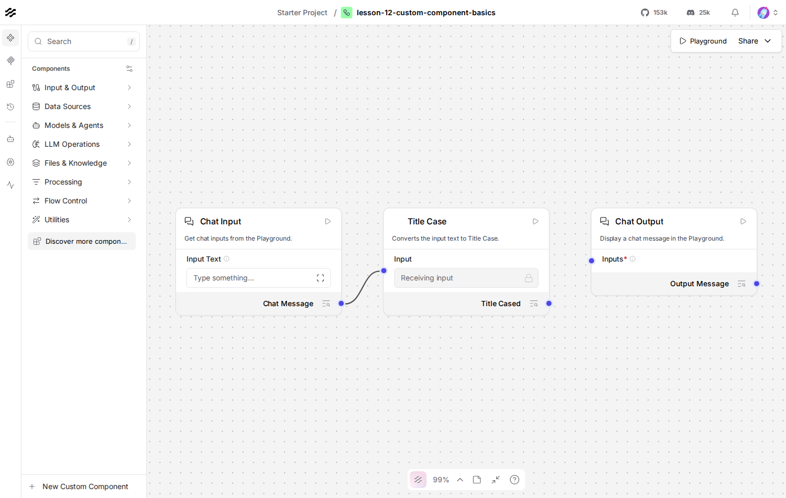

# Lesson 12: Custom Components

## Where we left off

Every component so far, Chat Input, Prompt Template, Google Generative
AI, has been something Langflow already ships. A **Custom Component**
is the same kind of object, an `inputs` list, an `outputs` list, one
method per output, but it's a plain Python class you write yourself.
That's the entire contract every built-in component is written to as
well, nothing about it is special-cased for Langflow's own code.

## Why this lesson runs the graph directly

Lesson 2's README flagged a real Langflow bug: loading a flow that
contains a component type the server doesn't recognize (which, by
definition, includes any Custom Component that isn't already installed
as a package) can trigger a runaway loop in Langflow's migration
subsystem, the part that tries to guess what an unrecognized component
type used to be called. That path only runs when a flow is
**deserialized from JSON**, `run_flow_from_json`, the REST API, or
importing a `flow.json` file on the canvas all go through it.

Building the graph in Python and calling `graph.arun()` directly, what
this lesson does, never touches that path at all, there's no JSON to
migrate, the component objects already exist in memory. This isn't a
workaround bolted on for this lesson, it's a legitimate, faster
development loop: you can iterate on a Custom Component's logic with
plain `python lesson.py`, no server, no browser, the same way you'd
develop and test any other Python class.

`flow.json` in this folder is shipped for reference, to look at, not to
reload through `run_flow_from_json` or the REST API. The "Do this
yourself" section below builds the equivalent flow by hand in the GUI
instead, pasting the component's code directly into a fresh Custom
Component rather than importing anything.

## Do this yourself

1. On a blank canvas, drag in **Chat Input** and **Chat Output** as
   usual.
2. In the component sidebar, find **New Custom Component** (near the
   bottom of the sidebar, or search "custom"). Drag it onto the canvas,
   it starts as a placeholder component with example code already in
   it.
3. Click the code icon (`</>`) on the new component to open its code
   editor. Delete the placeholder code and paste in exactly the
   `TitleCaseComponent` class from `lesson.py` below. Click the
   checkmark to save, the component on the canvas relabels itself
   "Title Case" with an **Input** field and a **Title Cased** output,
   read straight from the class's `display_name`, `inputs`, and
   `outputs`.
4. Wire Chat Input -> Title Case's Input, Title Case's Title Cased ->
   Chat Output. Compare to `canvas.png`, a screenshot of exactly this:

   

5. Run it in the Playground with something lowercase, confirm the
   output comes back Title Cased.

## The code, piece by piece

```python
class TitleCaseComponent(Component):
    display_name = "Title Case"
    inputs = [MessageTextInput(name="input_value", display_name="Input")]
    outputs = [Output(display_name="Title Cased", name="output_value", method="to_title_case")]

    def to_title_case(self) -> Message:
        return Message(text=self.input_value.title())
```

`display_name` is what shows on the canvas node. Each entry in
`inputs` becomes a field on that node, each entry in `outputs` names a
connectable output port and points at the method that produces it, the
exact same fields the pasted-in-the-GUI version reads to build the
node's shape. `self.input_value` inside the method is set from
whatever's wired into the `input_value` field, `chat_input.message_response`
in this lesson's graph, a typed-in string if you leave it disconnected
on the canvas.

```python
graph.prepare()
results = asyncio.run(graph.arun(inputs=[{"input_value": "..."}]))
```

`arun()` is `Graph`'s own direct execution method, no server, no JSON
serialization round trip, just this process running the components it
already holds in memory. `graph.prepare()` resolves the run order
first (Lesson 5's `topological_sort()`, under the hood).

## Running it

```bash
uv run python lessons/langflow/02_intermediate/12_custom_component_basics/lesson.py
```

No running Langflow server is required for this one, that's the point.

## Expected output

Exact, this lesson has no model call and nothing non-deterministic in
it:

```
Title Cased: The Trade-Off Between Prototyping And Production
```

## Checkpoint

- **Custom Component**: a plain Python class, `inputs`, `outputs`, one
  method per output, the same contract every built-in component uses.
- **why `graph.arun()` here**: it runs the in-memory graph directly, no
  JSON deserialization involved, which is what the Lesson 2 migration
  bug requires to trigger. A genuinely faster iteration loop for
  developing a Custom Component, not just a caution-driven workaround.
- **`flow.json` in this lesson**: shipped for reference only, the
  hands-on GUI build uses the "New Custom Component" + paste-code path
  instead of importing it.

If anything here still feels unclear, ask before moving to Lesson 13.
