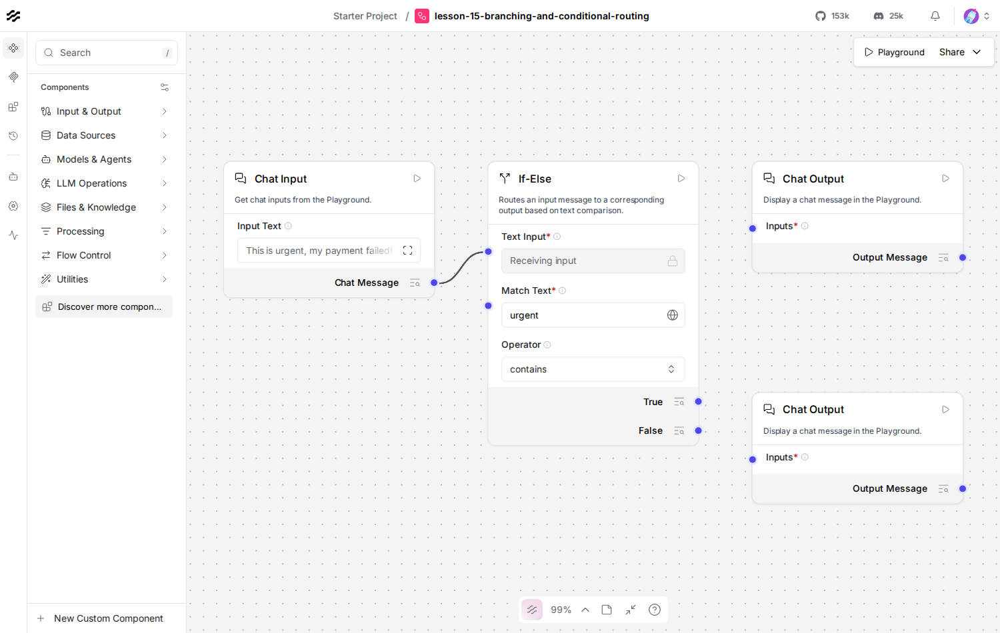

# Lesson 15: branching with the Conditional Router

## Where we left off

Every flow so far has been one straight line, or one line with an
Agent deciding *whether* to make a side trip to a tool. The
**Conditional Router** component branches the line itself: one input,
a condition, two possible paths, and only one of them actually runs.
If you've done `langgraph`, this is the direct Langflow equivalent of a
conditional edge.

## Do this yourself

1. Add **Chat Input**, a **Conditional Router** (search "conditional"
   in the sidebar), and two **Chat Output** components.
2. Wire Chat Input into the router's **Text Input** field. Set
   **Operator** to `contains`, **Match Text** to `urgent`, leave
   **Case Sensitive** off.
3. Fill in **True Case Message** ("Escalating to a human, priority
   queue.") and **False Case Message** ("Logged, we'll get to it in the
   usual order.").
4. Wire the router's **True Result** output into one Chat Output, its
   **False Result** output into the other. Compare to `canvas.png`:

   

5. In the Playground, send "this is urgent, my payment failed" and
   watch only the True-branch Chat Output produce a message, run it
   again with "just checking in, no rush" and watch the other branch
   fire instead. The path that doesn't match never runs at all, it's
   not that its message is empty, it's skipped entirely.

## The code, piece by piece

```python
router.set(
    input_text=chat_input.message_response,
    operator="contains",
    match_text="urgent",
    true_case_message=Message(text="Escalating to a human, priority queue."),
    false_case_message=Message(text="Logged, we'll get to it in the usual order."),
)
```

`operator` supports more than `contains`, equals, starts/ends with,
regex, and numeric comparisons are all options, useful for routing on
things other than free text. The two `*_case_message` fields are what
get forwarded down whichever path is taken.

```python
graph = Graph()
graph.add_component(chat_input)
graph.add_component(router)
graph.add_component(urgent_output)
graph.add_component(normal_output)
```

Every earlier lesson used `Graph(start=..., end=...)`, a shortcut that
only works for a single start and a single end. A branching graph has
two possible ends, so this lesson builds it the more general way,
adding each component individually, the edges themselves are still
inferred from the `.set()` calls above, exactly like every other
lesson.

```python
for run_output in results:
    for out in run_output.outputs:
        print(f"  -> {out.component_display_name}: {out.messages[0].message}")
```

Only the taken branch's Chat Output shows up in `results` at all, run
this and count the lines, one "Input" line, then exactly one `->` line
underneath it, never two.

## Running it

```bash
uv run python lessons/langflow/02_intermediate/15_branching_and_conditional_routing/lesson.py
```

No running Langflow server is required for this one.

## Expected output

Exact, this lesson has no model call and nothing non-deterministic in
it:

```
Input: This is urgent, my payment failed!
  -> Chat Output: Escalating to a human, priority queue.

Input: Just checking in, no rush.
  -> Chat Output: Logged, we'll get to it in the usual order.
```

## Checkpoint

- **Conditional Router**: one input, a condition (`operator` +
  `match_text`), two possible output paths, only the matching one runs.
- **branch pruning**: the non-matching path isn't run with an empty
  result, it's excluded from execution entirely, same idea as
  `langgraph`'s conditional edges.
- **multi-end graphs**: `Graph(start=, end=)`'s shortcut only fits a
  single terminal component, a branching graph needs
  `add_component()` for each node instead.

If you can make these changes confidently, you're ready for Lesson 16,
the Intermediate checkpoint.
